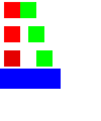
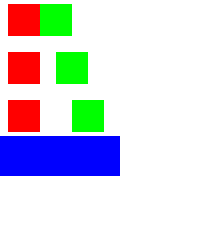

# Value-aware callbacks through nested components: opt-in proof

This is a compiled feasibility proof for the next production chunk. It is included only with
`-PboundActionProof=true`; absent or false leaves both generated sources and new tests out of the
Android and desktop proof builds. No production exporter or browser control invokes the prototype.
The already implemented state/layout/loop exports remain unchanged.

The [semantic document](document.json) contains three authored rows with integer IDs 10, 20 and 30.
Each row calls a reusable component that forwards its arguments and callback to another component.
The binding names deliberately change at each boundary: `itemId` → `selectedItem` → `destination`.
A binding used only in an action must therefore participate in the component's typed signature.
The left cell assigns that row's ID; the right cell resets the shared state to 10. Row gaps remain
0, 8 and 16 dp, with placement padding outside the component body.

The isolated generator emits the two targets from that same document:

- [Ordinary Compose](ComposeRepeatedContent.kt.txt) takes `(Int) -> Unit` callbacks and invokes
  them inside `Modifier.clickable` handlers. The caller owns the state assignment.
- [Creation-compose](RemoteRepeatedContent.kt.txt) takes `(Int) -> Action` factories. Each component
  creates its click action with its own argument during recording. The factory retains the actual
  mutable Remote state target, so the value change still runs in the player when clicked.

Both function layers take explicit values, callbacks and modifiers; neither captures a caller's
row implicitly. AndroidX `valueChange` is a non-composable action constructor in alpha18, which
makes this factory form possible without passing the mutable state implementation into every
component signature.

## Measured result

All four compile/interaction cases pass: ordinary Compose and AndroidX creation-compose/Android
player at densities 1 and 2. Every initial pixel matches the independent JSON/player reference
from the earlier repetition proof. Eight physical clicks per case visit rows out of order and
exercise every reset cell: 32 clicks in total. The selected state indicator is red for 10, green
for 20 and blue for the fallback selected by 30. Revisiting earlier rows after later rows checks
that handlers retain the correct instance's value.




The corresponding source, captured RC documents and all interaction images are adjacent. These
are compiled output captures, not screenshots of newly added browser controls. Existing default
repetition compile/interaction proofs also pass with the new flag omitted and explicitly false.
After the false builds, neither target contains compiled `BoundAction` or `boundactions` classes.
Kotlin formatting, the project boundary check and required golden regeneration pass with no
existing golden changes.

## Reproduce

From the repository root, first generate the original proof's sources needed by its isolated
Android project, then opt into the new source/test directories:

```sh
python3 experiments/remote-state-selection/generate-repetition.py
python3 experiments/remote-state-selection/generate-bound-actions.py
./gradlew :ui-builder-export:jvmTest --tests '*RemoteStateSelectionExportTest' \
  --tests '*RemoteRootSourceExportTest' --rerun
ANDROID_HOME=/path/to/android-sdk ./gradlew -p experiments/remote-state-selection \
  -PboundActionProof=true testDebugUnitTest --tests '*BoundActionSourceProofTest' --rerun
./gradlew -I experiments/remote-state-selection/desktop-proof.init.gradle \
  -PboundActionProof=true :ui-builder:jvmTest --tests '*BoundActionComposeProofTest' --rerun
```

The verified consumer run additionally selects the existing explicit local dependency manifest
with `-PlocalDependencies=build/local-dependencies/remote-export/local-dependencies.properties`.
No commit or release in another repository is required to run this proof. Use `-PboundActionProof=false`
or omit the property to keep the original experiment configuration.

## Implementation decision and limits

Proceed with typed callback parameters/invocations in the shared Compose model and generator,
and the equivalent typed Action factories in the Remote emitter. Then connect typed action-value
bindings to authoritative validation, preview, JSON lowering, the existing behavior inspector and
MCP. Do not enable those controls merely because this standalone generator compiles.

The production generators currently refuse these action-only bindings. The preview's literal
state-write reader also needs a safe structured-value path before such bindings are enabled.
The build flag currently gates this proof, not a shipping UI-builder feature.

This profile proves integer values in static authored rows, including nested forwarding. Runtime
list mutation, other callback value types, callback payloads supplied by controls, composable slots,
per-instance state/addressing and complete catalog recipes remain required. It does not establish
full operation coverage or replace the production validation model.
