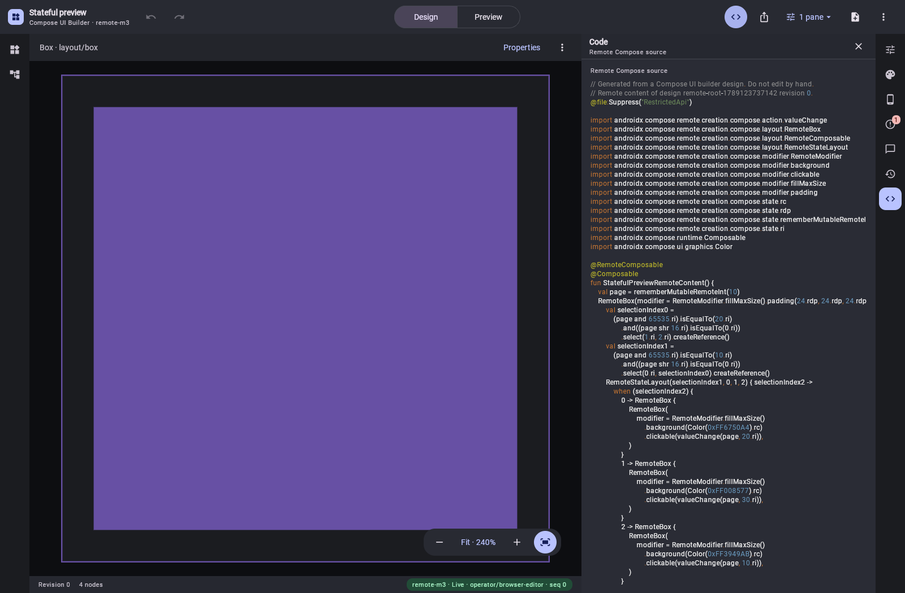

# Ordinary Remote roots: Kotlin, JSON and RC from the existing editor

The [saved semantic design](../ui-builder-live-document-preview/sample.document.json) has a Box,
a state selection with two cases and a fallback, 24 dp padding, and click actions which advance an
integer state. It has no Wear widget scaffold or synthetic Remote document node.

Previously, hosted MCP accepted the design but Kotlin export returned `NO_COMPONENT_RECORD`.
The catalog's declared Remote Compose platform now selects the same source emitter used by the
existing WASM Code pane. This also works for an arbitrary catalog system ID. Legacy Wear widget
and Wear screen exporters retain their specialized source forms.



The browser capture is unedited. `verify-remote-root-export.mjs` creates a fresh design over hosted
MCP using the server's catalog pin, exports Kotlin, JSON and RC at revision 0, verifies their
SHA-256 digests, and compares the Kotlin with the compiled fixture (only the fresh design ID in a
comment differs). It captures the actual editor after opening Code and reports no browser errors.
The painted code is visually reviewed; source equality is asserted through MCP.

- [Verification and artifact digests](verification.json)
- [Hosted Kotlin artifact](sample.kt.txt)
- [Hosted Remote JSON](sample.json)
- [Hosted binary document](sample.rc)
- [Exact compiled Kotlin fixture](../../fixtures/ui-builder/remote-root.kt.txt)

The standalone Android experiment compiles the exported function against real
`remote-creation-compose`, records its document using `captureSingleRemoteDocument`, and plays it
through Android's Remote player. It clicks purple → green → fallback blue → purple at densities
1 and 2, asserting each selected layout, 24 dp padding, and the 312 dp child width. This caught
layout click bindings being silently omitted; the shared emitter now writes them into
`RemoteModifier.clickable`. A catalog control with its own Action callback gets that callback
once, including when its parameter has a default.

| Native capture | Result |
| --- | --- |
| [Initial branch](native-first.png) | Purple, before clicking |
| [First click](native-second.png) | Green, second selected branch |
| [Second click](native-fallback.png) | Blue fallback |
| [Density 2](native-second-density2.png) | Same 24 dp padding and 312 dp layout |

The actual recorded documents are [density 1](native-density1.rc) and
[density 2](native-density2.rc). These captures need not be byte-identical to the JSON compiler's
binary artifact; recording paths may allocate different resource IDs and operations. The proof
checks layout and interaction semantics, not incidental byte identity between the two compilers.

Reproduce after staging local dependencies:

```sh
VERIFY_REMOTE_DOCUMENT_EXPORTS=true ./gradlew -PlocalDependencies=build/local-dependencies/remote-export/local-dependencies.properties :server:test --tests '*RecordFreeComposeExportTest' --tests '*ServeUiBuilderMcpIntegrationTest' :ui-builder-export:jvmTest
ANDROID_HOME=/path/to/android-sdk experiments/remote-state-selection/verify.sh
UI_BUILDER_TEST_TOKEN='<local-token>' CHROME_PATH='/path/to/Chrome' node preview-harness/verify-remote-root-export.mjs http://127.0.0.1:5624
```

Rebased on main `7012a87a` (including Compose 1.12), combined validation passes 951 editor JVM
tests, 51 shared-export tests and 36 targeted server/MCP tests, plus runtime ABI checks, the WASM
build and server distribution build. The browser proof was repeated against that rebuilt host.
The standalone Android proof passes all nine tests, including both ordinary-root density cases.

This closes ordinary-root source export in the editor and MCP. The separate server native PNG
compilation route still needs this root support. String/nullable state, broader recipes and
operation coverage, unsaved-document playback and reusable-component fidelity remain tracked in
[the implementation plan](../../UI_BUILDER_REMOTE_COMPOSE_IMPLEMENTATION.md).
