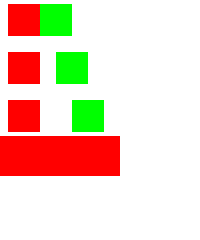

# Kotlin loops, composables and callbacks: feasibility proof

The existing semantic [three-row design](../ui-builder-repetition-export/repetition-initial.document.json)
now has an independently compiled source-generation proof for both ordinary Compose and
`androidx.compose.remote:remote-creation-compose:1.0.0-alpha18`.

This is the proof before production generator integration. The existing browser/MCP JSON, RC and
PNG paths remain implemented; their Kotlin loop refusal has not yet been replaced by this prototype.
There is no new editor or substitute Remote component implementation.

## Source shape proved

[`generate-repetition.py`](../../../../experiments/remote-state-selection/generate-repetition.py)
reads the committed semantic document and emits two separate Kotlin files:

- A typed row class and actual `listOf(...).forEach`, retaining the authored row values and spacing.
- One reusable `@Composable` function whose numeric argument supplies its Row spacing.
- A modifier parameter applied to a Box around the component body, retaining placement padding.
- Explicit callbacks supplied at each call, so the component body updates the enclosing shared state.
  Compose takes `() -> Unit`; Remote Compose takes AndroidX `Action` values.
- Ordinary Compose selection uses `when`; Remote selection uses the production-proven exact integer
  comparison form and `RemoteStateLayout`. The surrounding layout retains its modifiers.

The prototype supports the fixture's numeric layout bindings, literal modifiers and integer state.
It allocates source identifiers and parses numbers/colours rather than copying authored text into
source. It is an experiment, not a complete validator or a second production generator. Shared
generator integration must retain authoritative catalog validation and the existing refusal rules.

[Ordinary Compose source](ComposeRepeatedContent.kt.txt) ·
[Remote Compose source](RemoteRepeatedContent.kt.txt)

## Measured result

All four compile/interaction tests pass: ordinary Compose and Remote Compose, each at densities
1 and 2. AndroidX captures the Remote source to an actual document and its Android player paints
and dispatches clicks. The ordinary Compose source runs in the existing builder's desktop test lane.

Each initial image is compared pixel for pixel with the independently generated JSON/player
reference from the earlier proof. Every test then clicks each of the six cells, checking shared state
after each click. Across the four cases, all 24 clicks select the expected red/green indicator.

| Target | Density 1 | Density 2 |
| --- | --- | --- |
| Ordinary Compose | Exact pixels, six clicks | Exact pixels, six clicks |
| AndroidX creation-compose / Android player | Exact pixels, six clicks | Exact pixels, six clicks |




The source files, captured RC documents and all interaction PNGs are adjacent.
`verification.json` records source/artifact hashes and comparisons of corresponding captures.
After a click, ordinary Compose's click indication darkens that cell from channel value 255 to 229;
Remote Compose draws no equivalent indication. The difference is confined to the clicked 16 dp cell
(256 pixels at density 1; 1,024 at density 2). Every other pixel, including the changed state indicator,
matches exactly. The proof preserves standard Compose click behavior instead of disabling its
feedback to make the screenshots identical. Interaction styling remains later polish.
No incidental byte equality is expected between the JSON compiler and creation-compose recorder.

## Reproduce

From the repository root, using the staged local dependency manifest and local Android SDK:

```sh
python3 experiments/remote-state-selection/generate-repetition.py
ANDROID_HOME=/path/to/android-sdk ./gradlew -p experiments/remote-state-selection \
  testDebugUnitTest --tests '*RepetitionSourceProofTest'
./gradlew -I experiments/remote-state-selection/desktop-proof.init.gradle \
  -PlocalDependencies=build/local-dependencies/remote-export/local-dependencies.properties \
  :ui-builder:jvmTest --tests '*RepetitionComposeProofTest'
```

On a fresh checkout, run `experiments/remote-state-selection/verify.sh` first to regenerate the
existing selection sources used by the Android project. It runs these proofs as well. Android
dependencies remain isolated in the experiment; the production builder module graph is unchanged.

## Implementation decision

Proceed with typed row/function/callback lowering in the shared Compose generator and Remote emitter.
The proof demonstrates an implementable source form that preserves the authoring hierarchy; it does
not require expanding the saved design or compiling a new application for each JSON preview.

Still required: production generation and browser/MCP source parity, catalog-derived parameter
types, nested scope/name validation, callbacks with values and slots, runtime list changes, per-instance
state and MCP addressing. Lazy-list identity and transition/retention polish are not established here.
