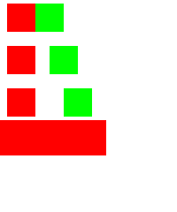
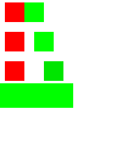

# Production Compose export of loops and reusable components

The shared projection now exports the existing semantic
[editor design](../ui-builder-repetition-export/repetition-initial.document.json) through
`ScreenDocumentProjection` and `ScreenGenerator`. The existing browser Code pane and service export
use this projection. The saved tree remains unchanged. Shared expression packages now also admit `kotlin.math` so
bound spacing combined with alignment can clamp negative gaps with `max(0f, gap)`, matching the canvas.

The [exact generated source](ComposeRepeatedContent.kt.txt) contains a typed three-row list, a real
`forEach`, one reusable `Pair` composable, and explicit state-changing callbacks. The call passes the
placement's padding as a modifier. Each row supplies its own 0, 8 or 16 dp gap to the reusable body.
The state indicator remains an ordinary Compose `when`.

`ScopedComposeProjectionTest` generates this file against the committed Material 3 component record.
`RepetitionComposeProofTest` then compiles that file in the existing builder's desktop test lane.
Both density cases pass: every initial pixel matches the independent Remote JSON/player reference,
and each of the six physical clicks per density selects the expected red/green indicator. These
are captures of the compiled export, not browser screenshots or mockups.




The staged run passes all 74 shared-export tests, 954 editor tests (one separate opt-in proof
skipped), 60 targeted service projection/export tests and WASM compilation. The nine new projection
tests cover empty rows, conflicting/missing argument types, lexical scope,
nested loops and component forwarding, state parameters, and spacing combined with alignment.
The browser export gate is compared with this same source. A service executor test checks byte
equality with the browser gate after adding its separately checked revision/provenance header. These checks do not substitute for a fresh live browser/MCP run.

## Reproduce

With both generator publications from compose-ai-tools PR #5383 staged in the local manifest:

```sh
./gradlew -PlocalDependencies=build/local-dependencies/remote-export/local-dependencies.properties \
  :ui-builder-export:jvmTest --tests '*ScopedComposeProjectionTest' --rerun
./gradlew -PlocalDependencies=build/local-dependencies/remote-export/local-dependencies.properties \
  -PscopedProjectionProof -I experiments/remote-state-selection/desktop-proof.init.gradle \
  :ui-builder:jvmTest --tests '*RepetitionComposeProofTest' --rerun
```

The opt-in source directory contains only the production export. Omitting `-PscopedProjectionProof`
continues to run the earlier experimental generator proof. No published dependency or module graph
change is needed. On the released dependency floor, new scoped constructs report a located refusal;
the projection remains compilable. Tests that require those constructs check this refusal there.

## Remaining work

Remote Kotlin still needs its equivalent production integration. The initial JSON/RC/PNG export
paths already support this fixture, but that does not establish Kotlin parity for every operation.
Runtime lists, callbacks with values or slots, per-instance state/addressing and additional binding
types remain required. The compiled evidence establishes this production Compose projection, not
the full Remote Compose completeness goal.
