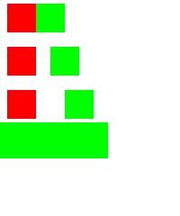
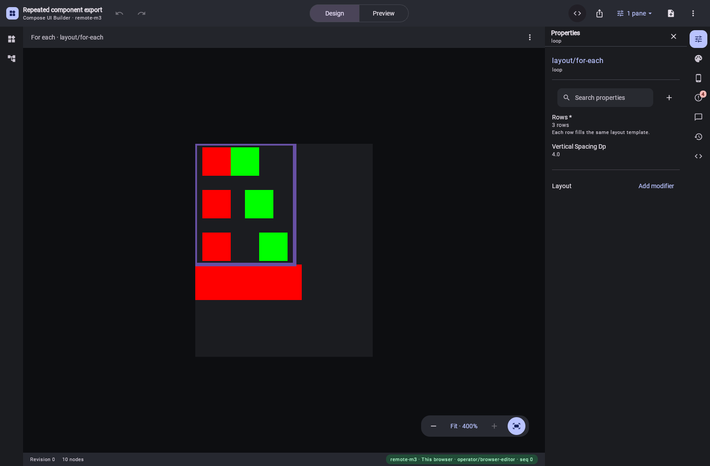
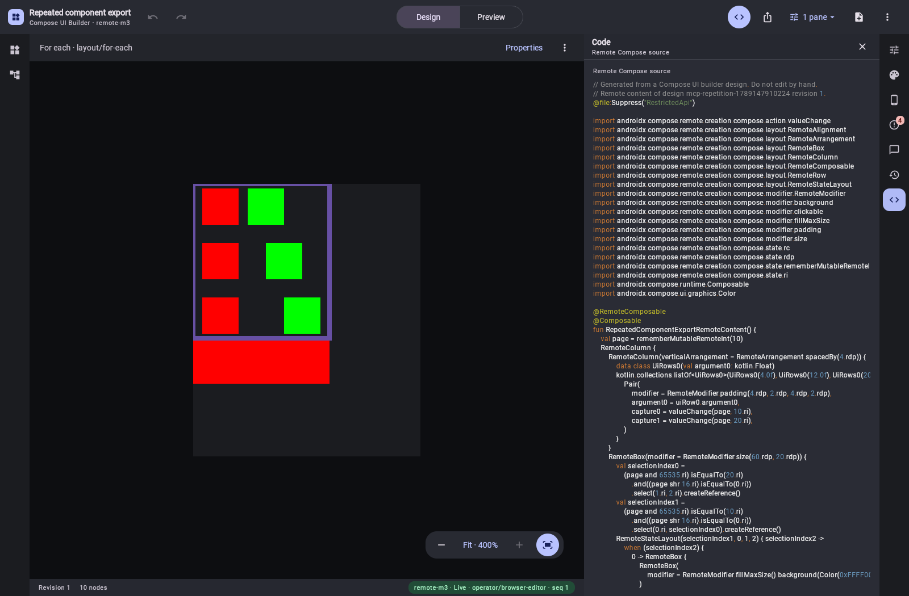

# Production Remote Kotlin export of loops and reusable components

The production `RemoteContentEmitter` now exports the existing semantic
[editor design](../ui-builder-repetition-export/repetition-initial.document.json) as creation-compose
source. The saved document keeps its layout tree, row template and reusable component definition.
The existing WASM editor and service export call the same emitter.

[Exact generated source](ExportedRemoteContent.kt.txt) contains a typed three-row list, an actual
`forEach`, one reusable `Pair` composable and explicit AndroidX `Action` parameters. Each call passes
the placement modifier and that row's spacing. State reads and images inside definitions are also
passed explicitly. Nested component calls forward their arguments and captures; nested row
initializers can read the enclosing row while each template reads its own row.

`RemoteScopedSourceExportTest` writes the exact production export. `RepetitionSourceProofTest`
compiles it against `remote-creation-compose:1.0.0-alpha18`, captures a real document and exercises
AndroidX's Android player. A [small entry point](ProofEntry.kt.txt) calls the export without rewriting
its source. At densities 1 and 2, every initial pixel matches the independently generated JSON/player
reference. All six physical clicks at each density select the expected red/green shared state.




Eight focused tests cover the source form, empty templates, missing and mismatched arguments,
lexical scopes, nested function forwarding, nested row initialization, unsafe names and unsupported
modifier bindings. Loop and placement clicks are preserved, and unsupported or malformed event
bindings refuse rather than disappear. All 82 shared-export tests and 954 editor tests pass, with one separate opt-in
editor proof skipped. The WASM frontend and server distribution build successfully. Kotlin formatting, the project
boundary check and required golden regeneration pass; no existing golden changes.

## Existing WASM editor and live MCP

The local server proof uses the packaged renderer and existing WASM app. The browser physically
clicks all six repeated cells, then downloads JSON, RC and PNG before and after editing the initial
state from 10 to 20. All six downloaded files match independent MCP exports byte for byte, including
digests. The temporary exports do not create a saved design.

MCP then creates a saved design and edits row spacing from 0/8/16 to 4/12/20 at revision 1. Its saved
JSON matches a supplied-document export; the reusable definition stays intact. Its
[Kotlin export](repetition-mcp-edited.kt.txt) retains the typed loop, shared function and explicit
actions. The browser opens that saved revision and its Code pane produces the same source body.
The comparison removes only the service provenance header and artifact package declaration, which
the pane deliberately omits, and ignores terminal whitespace. It reads rendered text to retain DOM
line breaks. [Verification results](repetition-verification.json) record the hashes and interactions;
there are no browser errors.




The harness observed a stale Compose accessibility overlay after switching docks, even while the
canvas displayed the new panel. A viewport relayout refreshes the overlay before querying its
controls; the screenshot dimensions are restored to 1600 × 1050. This is a harness accommodation,
not a claim that the underlying accessibility issue is fixed.

## Reproduce

From the repository root, with the explicit local dependency manifest staged:

```sh
./gradlew -PlocalDependencies=build/local-dependencies/remote-export/local-dependencies.properties \
  :ui-builder-export:jvmTest --tests '*RemoteScopedSourceExportTest' --rerun
ANDROID_HOME=/path/to/android-sdk ./gradlew -p experiments/remote-state-selection \
  -PscopedProjectionProof testDebugUnitTest --tests '*RepetitionSourceProofTest' --rerun
```

The opt-in source directory selects this production export; without the property the earlier
prototype remains available. Android proof dependencies stay in the existing isolated experiment.
No upstream release is required.

For the browser/MCP proof, build `:ui-builder:wasmFrontendDist :server:installDist` against the same
manifest, then run:

```sh
VERIFY_REMOTE_PNG_EXPORTS=true VERIFY_REMOTE_PNG_BROWSER=true \
VERIFY_REMOTE_REPETITION_BROWSER=true \
UI_BUILDER_REAL_RENDER_APP_HOME="$PWD/server/build/install/compose-preview-server" \
./gradlew --no-configuration-cache -I preview-harness/java21-render-proof.init.gradle \
  -PlocalDependencies=build/local-dependencies/remote-export/local-dependencies.properties \
  :server:test --tests '*RemotePngExportProofTest' --rerun
```

Set `CHROME_PATH` to an installed Chrome executable when Playwright's bundled browser is unavailable.

## Remaining scope

This proves authored static rows and the supported lexical value bindings. Runtime list changes,
callbacks with values or content slots, per-instance state/addressing, additional binding types and
complete catalog-specific lowering remain required. This evidence does not claim 80% operation
coverage or exact parity for every Remote Compose feature.
