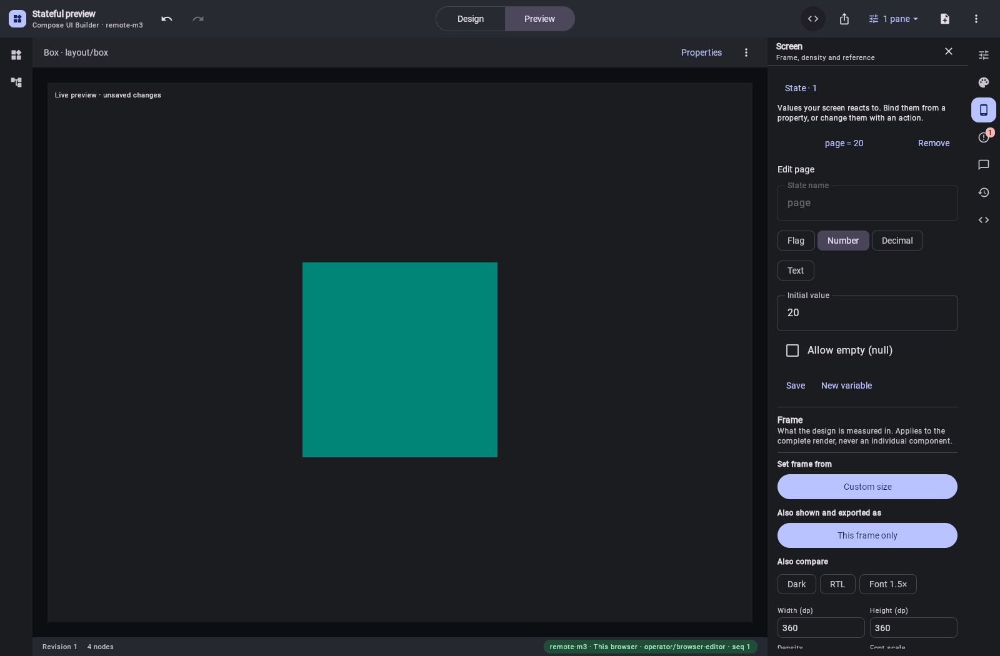

# Unsaved Remote documents in the existing WASM editor

This proof opens a design from the browser's local storage, without creating it on the server.
It uses the same semantic Box/state-selection design as the saved-document proof. The existing
Preview button POSTs its current `DesignDocumentV1` to `/api/ui-builder/v1/documents/export.rc`,
then plays the real compiled document through the existing CMP/WASM player.



The browser proof:

1. Seeds one record in the existing local-design store and opens the normal editor URL with
   `storage=local`.
2. Previews and clicks through purple, green and the blue fallback.
3. Returns to Design, edits `page` from 10 to 20 through the existing Screen inspector and saves
   that declaration locally. It verifies the typed value has reached Compose before pressing Save.
4. Previews again and checks the POSTed document contains 20 and the recorded document starts on
   the green branch.
5. Downloads JSON and RC through the actual Export menu, comparing every byte and SHA-256 digest
   with `ui_builder_export_document` on hosted MCP.
6. Checks the design is absent from the server's design list and no saved-design RC URL was used.

[Verification](verification.json) records requests, measured playback bounds, colors and digests.
The final run reports no browser errors. [JSON](local.json), [RC](local.rc) and the
[current semantic document](document.json) are the actual artifacts. [State editor](state-editor.png)
and [Export menu](export-menu.png) are unedited browser screenshots. Local export links are absent
because no server design exists to address.

The harness uses measured Compose accessibility bounds for input. The state form's textboxes have
no accessible names in this Wasm build, so the observed second textbox is the initial value. Popup
rows expose button roles and content descriptions. The fixed toolbar button's measured location is
retained while the popup restores its accessibility tree after a download.

Run against the combined locally staged build (contracts, compiler and player):

```sh
UI_BUILDER_TEST_TOKEN='<local-token>' CHROME_PATH='/path/to/Chrome' node preview-harness/verify-unsaved-remote-preview.mjs http://127.0.0.1:5625
```

The same harness accepts `pending` as its third argument. That run holds the live save request,
previews and downloads the current draft, checks the stored design is still at revision 0 with its
original state, then releases the request. The saved revision-1 export is byte-identical to the
temporary one and the browser shows the green branch. See [pending-save verification](pending/verification.json)
and [the actual saved frame](pending/saved-after-pending.png). After closing the popup, Compose can
leave the preview accessibility node with empty bounds; that final pixel check uses the same pane
rectangle measured before the popup, as recorded in `boundsSource`. The screenshot was also reviewed.

The combined verification passes 952 editor tests, 51 shared-export tests, all 189 runtime tests and
34 targeted server/MCP tests, plus runtime ABI checks and the WASM/server distribution builds.
Golden regeneration passes without changes to existing fixtures.

The service applies existing catalog/topology/environment validation and export quotas before
compilation. It neither looks up a saved design nor changes saved state, revisions, history or audit
records. HTTP tests also compile a supplied document sharing a saved design's ID and verify all
saved files remain byte-identical. Unsupported content remains a located export refusal.

The temporary endpoint accepts Remote JSON/RC only. Fully disconnected compilation, native PNG
compilation and the standalone MCP adapter's supplied-document forwarding remain separate work.
The broader operation-coverage goal is retained in the
[implementation tracker](../../UI_BUILDER_REMOTE_COMPOSE_IMPLEMENTATION.md).
