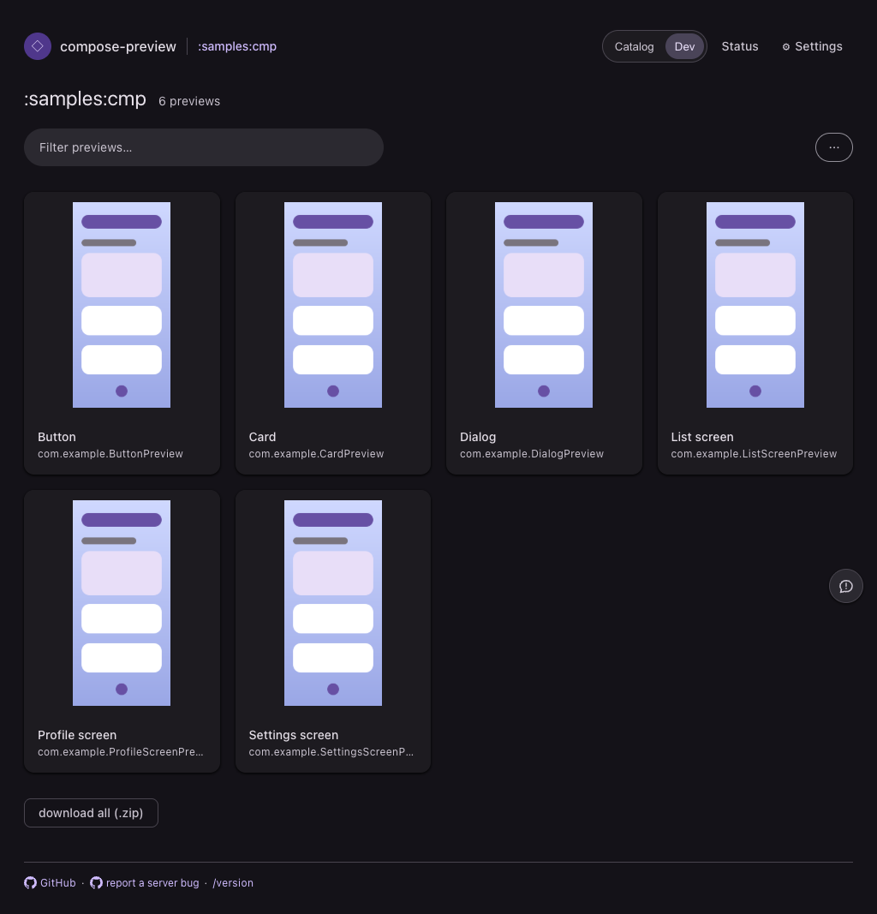
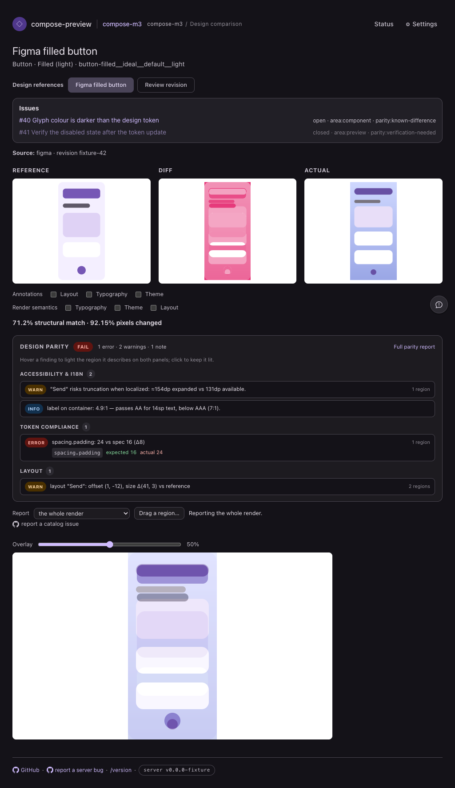
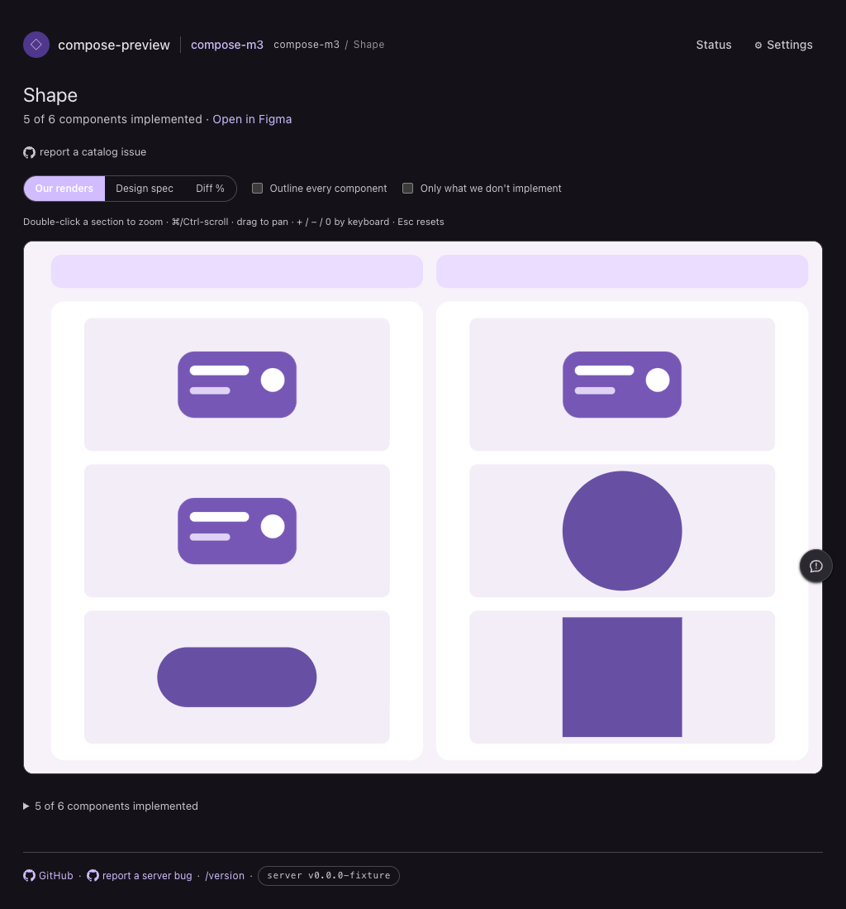
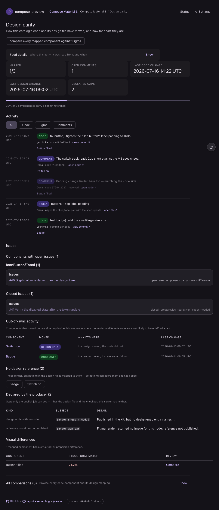
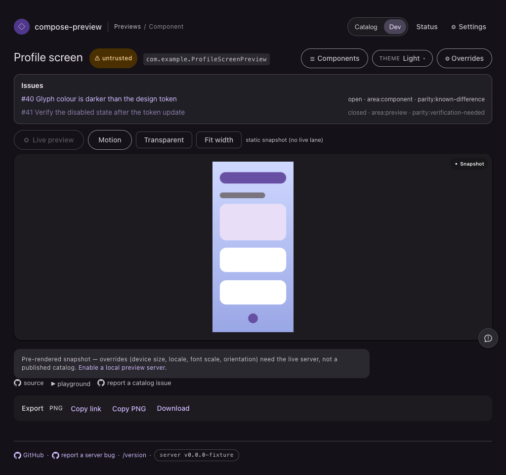

# Vue surface-bundle split evidence

The switch changes delivery and script composition, not layout. These captures run the committed
page fixtures through their production CSS and generated JavaScript. Five surfaces cover every new
component entry: catalog, compare, design, parity, and viewer.

| Surface | Before | After |
| --- | --- | --- |
| Catalog |  |  |
| Focused comparison |  |  |
| Design page |  |  |
| Parity |  |  |
| Viewer |  |  |

The catalog, design, parity, and viewer PNGs are byte-identical. The asynchronous comparison capture
has non-identical PNG bytes but no visible layout or functionality loss on inspection; it was
captured in its fully rendered state.

## Transfer measurements

Gzip totals include the shared Vue runtime and every generated control asset used by the named page.
They exclude CSS and the unchanged site-wide chrome/keyboard scripts.

| Page | Before | After | Reduction |
| --- | ---: | ---: | ---: |
| Catalog | 61 kB | 26 kB | 57% |
| Compare wall | 65 kB | 45 kB | 31% |
| Focused comparison + known differences | 104 kB | 63 kB | 39% |
| Design page | 65 kB | 37 kB | 43% |
| Parity + known differences | 104 kB | 45 kB | 57% |
| Viewer + comparison scorer | 83 kB | 61 kB | 27% |

`check-bundle-budgets.mjs` measures these compositions on every frontend verification run and fails
before any page grows past its recorded ceiling.
