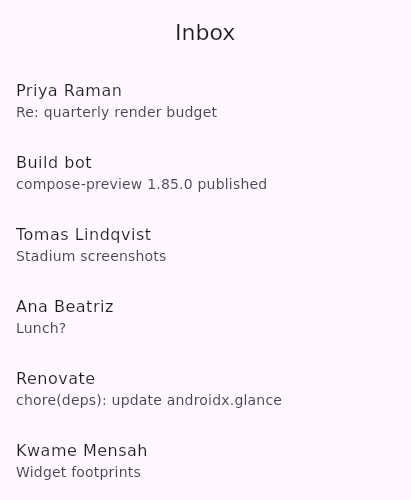
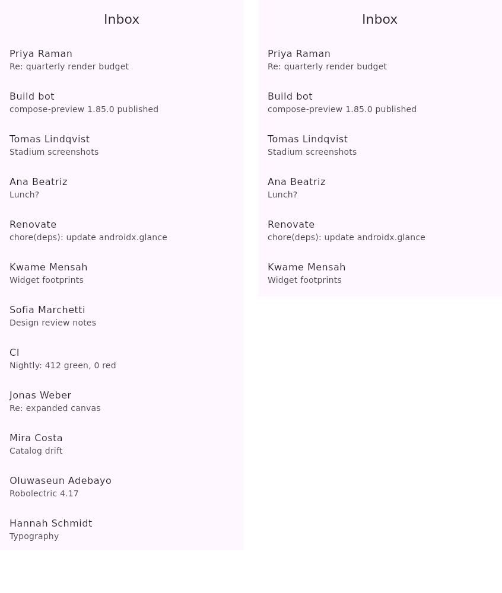

# The editor canvas draws the extent and the frame together

A 411dp screen — a `Scaffold` with a top app bar over a `LazyColumn` of twelve mails.

| before | after |
| --- | --- |
|  |  |

**Before:** the canvas drew the design at its frame and nothing else. Six mails are reachable; the
other six are laid out somewhere nobody can click, and the author edits a screen they cannot see.

**After:** the extent on the left — the frame's width, the content's height, lists unrolled — is the
surface edits land on, and all twelve rows are on it. The frame beside it is the real composition,
answering the question the extent cannot: what someone sees when they open the screen, and where the
fold falls. A design that fits its frame gets no second pane; two identical pictures say nothing the
one said.

The extent is a proxy, not the design's own composition, because Compose refuses to measure a
scrollable or a `SubcomposeLayout` against an unbounded height. What that swaps, and what it costs,
is on `LocalUiBuilderUnrolled`.
