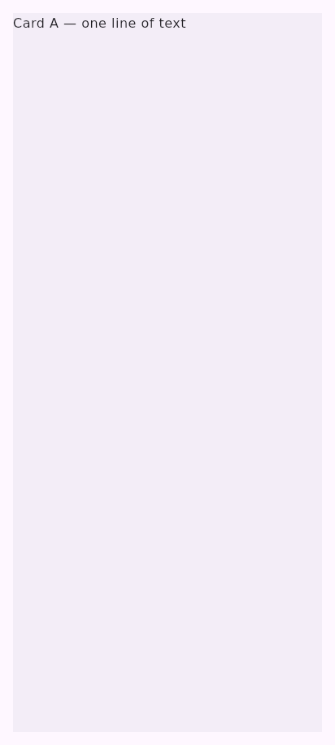
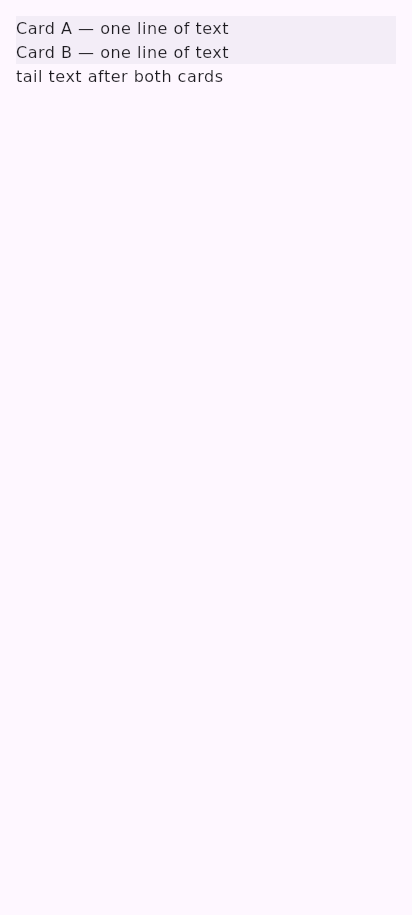
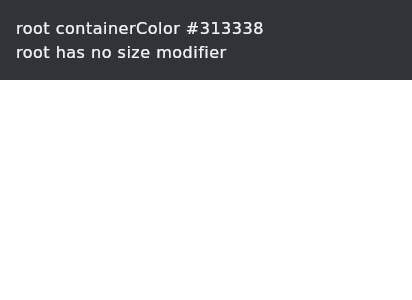
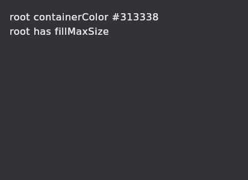

# A card wraps its content, and the frame's ground is the theme's

Rendered by `UiBuilderSurface` on the JVM at 412×915dp, density 1, light theme — the frame the
reports were made on (compose-preview-server #483, #485).

## `m3/card` with no height (#483)

The six-node repro: a surface, a padded full-width column, two full-width cards holding one line of
text each, and a text after them. No card has a height, a weight or a fill.

| before | after |
| --- | --- |
|  |  |

**Before:** card A takes the rest of the column — 883 of 915dp — and card B and the tail are never
laid out. The card drew its content in a `Box(Modifier.fillMaxSize())`, and a Column child's height
constraint is bounded by what the column has left.

**After:** both cards wrap their one line and the tail follows, the way `Card` lays out. The content
box fills only the axes the document sized (`cardContentFill`), so a card *with* a height still lets
a child align to its bottom edge.

## The root surface's `containerColor` and the frame (#485)

The same root `m3/surface`, `containerColor: #313338`, light theme; the only difference is the
root's modifiers.

| root with no size modifier | root with `fillMaxSize` |
| --- | --- |
|  |  |

A surface paints its colour across the area it is measured to and no further: a root with no size
modifier wraps its content and leaves the rest of the frame to `environment.theme`, and one that
fills the frame *is* the ground. Neither renderer was ignoring the property; the design was not
asking the root to cover the frame. That case is now named — `ROOT_SURFACE_DOES_NOT_FILL_FRAME` on
every export artifact, the same line in the editor's Issues panel, and a note on the catalog's
`containerColor` — rather than left to be inferred from a picture.
