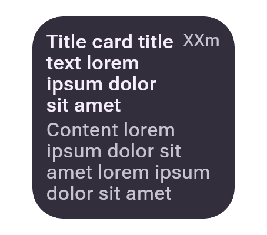
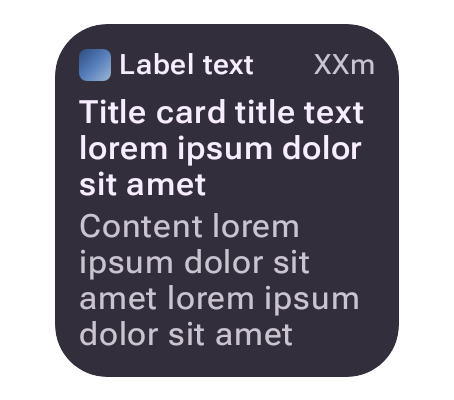

# The cmp-jvm lane reads the CMP/Wasm player's `fonts/`

Captured from preview.coo.ee on 3.115.x (compose-ai-tools 2.37.0, `lib-rcjvm` on rc-players
2.2.1, faces from the distribution's own `rc-fonts/`) at 454×400px, density 2, light theme:
`/remote-m3/render/<preview>.png` for the default player and the same URL with `?rcPlayer=cmp-jvm`.

| preview | default player | cmp-jvm, before |
| --- | --- | --- |
| `titlecard__ideal__default__compact` |  |  |
| `appcard__ideal__default__compact` |  |  |

cmp-jvm differs from the default player on 4.98% (Title card) and 5.33% (App card) of pixels by
more than 24/255 — the residual already recorded in [`../cmp-jvm-rc-fonts/`](../cmp-jvm-rc-fonts/README.md).

The change swaps the faces, not the family: `rc-fonts/` carried static Roboto Flex weights, while
the player's `fonts/` lists one variable Roboto Flex file per weight. rc-player-compose 2.2.1 drew
such a file at its default instance and cached every weight under one identity; 2.4.0 (via
compose-ai-tools 2.38.0) draws each listed weight. The "after" column is the same two URLs once
this release is on the box, and should stay within the same ~5% of the default player.
