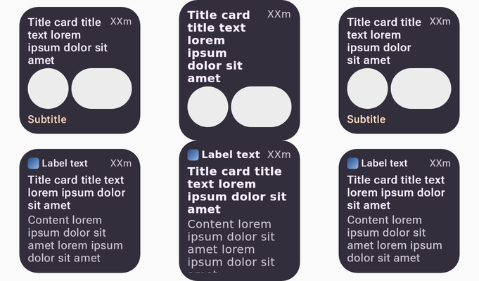

# The cmp-jvm lane draws remote-m3 cards in Roboto Flex

Rendered by the released compose-ai-tools 2.32.1 `lib-rcjvm/` worker (`RcJvmRenderMain`, the
subprocess `RcJvmServerRenderer` spawns) at 454×400px, density 2, light theme, from the published
`remote-m3` documents `TitleCardRemote_…_VARIANT_title-and-subtitle-gallery-2` (top) and
`AppCardRemote_…` (bottom).

**Left:** the published capture. **Middle:** the worker with no `fonts.json` — byte-identical to
what preview.coo.ee served for `?rcPlayer=cmp-jvm`: the documents' `google:Roboto Flex` falls back
to Compose's built-in face, the title wraps an extra line and the subtitle and body are pushed out.
**Right:** the worker pointed at the `rc-fonts/` this distribution now ships.

| document | before | after |
| --- | --- | --- |
| `AppCardRemote` (+ `icon`) | 27.05% / 26.52% | 5.32% / 5.32% |
| `TitleCardRemote` (8 variants) | 27.61–31.24% | 2.87–3.16% |
| `CheckboxRow` / `RadioRow` / `SwitchRow` split | 4.58 / 4.25 / 5.16% | 2.94 / 2.61 / 3.52% |

Mismatch is the share of pixels differing by more than 24/255 against the published capture.
