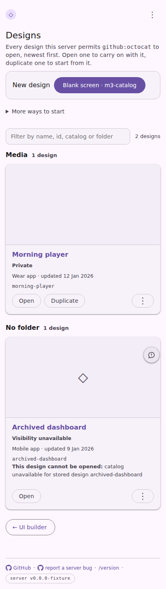
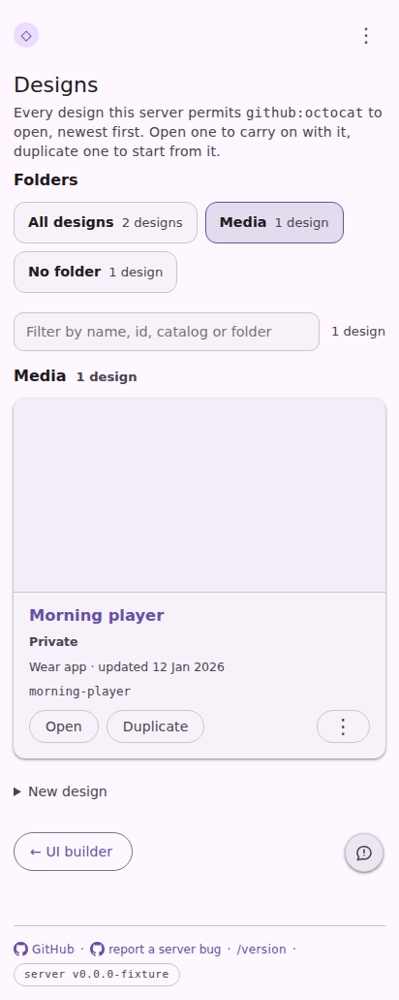

# Designs page: folders first, no quick-start box

The `serve-ui-builder-designs` fixture at 412 × 915, opened as `/ui-builder/designs?folder=Media`.

| Before (`main`) | After |
|---|---|
|  |  |

Before, the page opens on the one-press **New design** box and lists every folder in full; the
`?folder=` parameter means nothing. After, it opens on the list of folders with their counts,
`Media` is picked from the URL, the filter and the list below are narrowed to it, and the creation
forms are folded under **New design** beneath the list.
