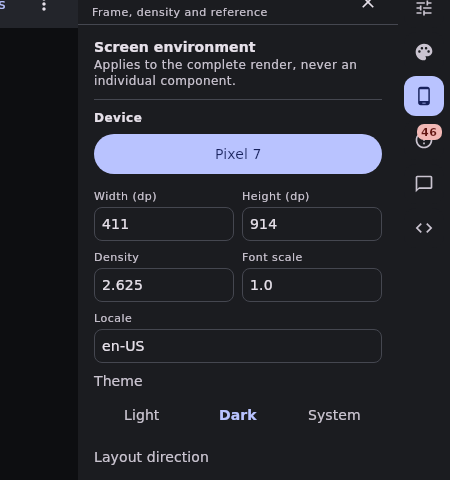
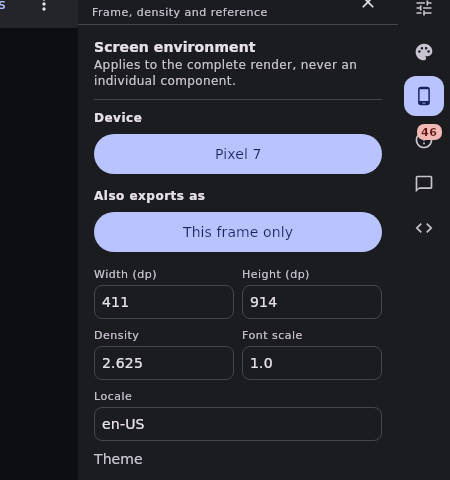

# A design names the devices it exports as

The Screen inspector, from `UiBuilderDevicePresetPhonePreview` — the preview this repository already
diffs for the device menu.

| before | after |
| --- | --- |
|  |  |

**Before:** one device, and it is the frame. "Which devices does this screen claim to work on?" had
no answer in the document, so each exporter guessed one from the catalog it happened to be
generating for.

**After:** the frame stays a single choice — it is the canvas somebody approved — and **Also exports
as** is the set beside it. It reads `This frame only` until someone picks, which is what every
design written before the field already said.
