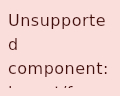

# One template, three rows

Rendered by `UiBuilderSurface` on the JVM at 120×96dp, density 1, light theme. The design holds one
`layout/for-each` whose `data` is a list of three dictionaries, and one template — an `m3/surface`
whose `containerColor` reads the row's `shade`.

| before | after |
| --- | --- |
|  |  |

**Before:** the catalog had no loop, so the node fell through to `UnsupportedComponentDiagnostic`.
A designer who wanted three cells authored three nodes, and a design whose data grew was a design
edited by hand.

**After:** three cells, three shades, from one authored template and the design's own rows. What the
loop adds is where the dictionary comes from — the row rather than a placement's arguments — and
nothing else: the binding reader, the substitution and the instance paths are the ones component
placements already use.

The export is deliberately not part of this: `CapabilityComposeCodeExporter` refuses a loop by name
(`UNSUPPORTED_CODE_COMPONENT`), because a faithful `forEach` needs a generated data class for the
row, its properties derived from the keys the template binds. That is the next step.
