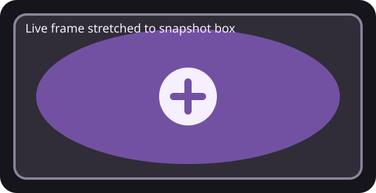
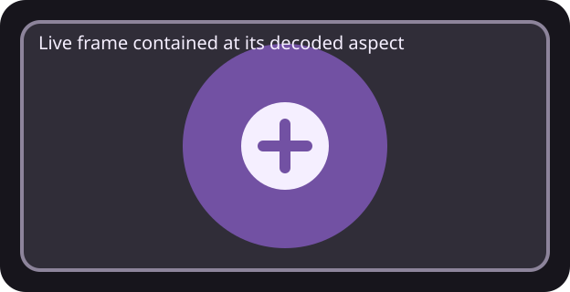

# Live frame aspect preservation

Visual proxy for [#744](https://github.com/yschimke/compose-preview-server/issues/744).
The real surface requires an authenticated live daemon session, so these two deterministic SVGs
isolate the layout rule the viewer applies to the same square live frame inside a wide baked
snapshot footprint.

Before, `decodeAndPaint` read `ImageBitmap.width` and `height` after calling `close()`. Detached
bitmaps report zero dimensions, so `fitLiveCanvas` fell back to stretching the canvas across the
entire snapshot box. After, the decoded dimensions are cached before release and the square frame
is scaled with `contain` and centred. The foreground circle therefore stays circular.

| Before | After |
| --- | --- |
|  |  |

The source-order assertion in `ServeWebFixtureTest` is the executable regression check; these
drawings are review evidence for the visible consequence.
