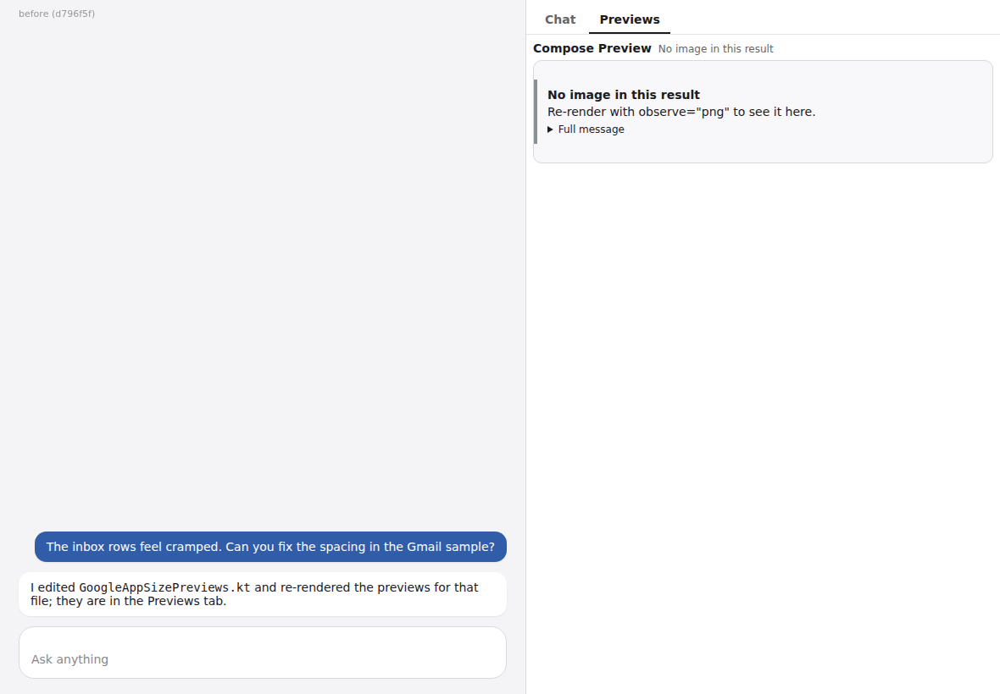
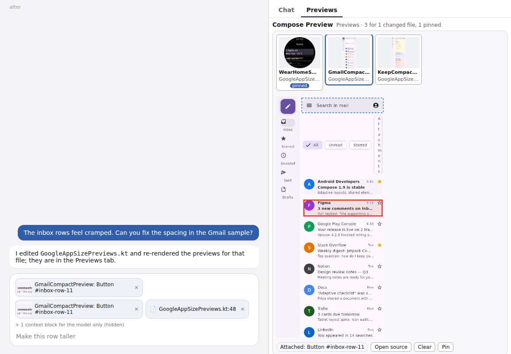

# The Previews tray, with a node pointed at

Evidence for [#1238](https://github.com/yschimke/compose-preview-server/issues/1238): the viewer
(`mcp-app/compose-preview-viewer.html`) opened as a thread tab from a `previews_tray` result, in a
**fake MCP Apps host** driven by Playwright and Chromium. The host page imitates a thread with a
side tab and a composer. Its composer draws each `ui/update-model-context` block the viewer sends as
a chip, and it counts the blocks marked `annotations.audience: ["assistant"]` as hidden. Those chips
are the fake host's drawing. They are not ChatGPT's.

| before (d796f5f) | after |
| --- | --- |
|  |  |

**Before:** the viewer has no tray mode. A `previews_tray` result carries no image and no resource
link, so the viewer shows "No image in this result", and the person cannot point at anything.

**After:** the tray lists the three previews in the changed file. The pinned one comes first, and
each card shows its cached render. `GmailCompactPreview` is open. The person clicked the Figma inbox
row, so the deepest semantics node under the pointer is outlined in red, and the dashed box is the
node under the hover. The composer holds the selection as chips:

- the cropped node;
- the titled text block (role, testTag, bounds and preview URI);
- a `resource_link` to `GoogleAppSizePreviews.kt:48`;
- one block for the model only, holding the semantics subtree.

The three renders are real `composePreviewRender` output, committed under
[`renders/google-app-designs/`](../../../renders/google-app-designs/README.md). The
`compose/semantics` tree for the Gmail render is **hand-written**: its bounds were measured off the
image and were not captured from the renderer. The source path and line numbers are also
illustrative.
