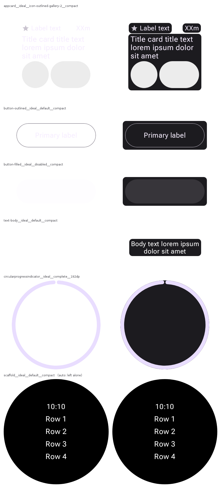

# A render carries its stage when it leaves the page

`?bg=` on `/render/<id>.png` composites the preview's resolved ground into the bytes, in the shape
of what is actually on the canvas. `ServeRenderMatte` is the implementation; this is why it exists
and how `auto` decides.

## The hole

Every surface this server draws already puts a preview on a ground: the grid card, the viewer, the
compare wall, the reference-compare page. Every one of them does it in **CSS**, from `PreviewBackdrop`
for the colour and `PreviewClip` for the shape. The pixels never carried any of it.

That is right for the archived artefact — a `showBackground = false` sticker is transparent so a
designer can drop it on any canvas, the header's Transparent toggle inspects the raw alpha, and the
fidelity scorer masks with the clip — and wrong the moment a PNG **leaves the page**. A GitHub
embed, Copy PNG, a paste into a prompt: only the alpha travels, and a dark-first catalog's
light-on-nothing sticker lands on white as a blank rectangle.

[wear-m3-catalog#284](https://github.com/yschimke/wear-m3-catalog/issues/284) is the case. It reports
an outline card missing its border, and its embedded screenshot shows neither the card nor the
border. Measured on those very bytes: **19.6%** of the frame carries any alpha at all, and the ink
that is there has mean luminance **237/255**.

So the resolvers were already written and already agreed with each other. What was missing was a lane
that put their answer into bytes.

## Before / after

Left: the published render on GitHub's white page. Right: the same request with `?bg=auto`. Both
columns produced by the shipped `ServeRenderMatte`, over live `remote-m3` renders.

Reading down:

- **`appcard__ideal__icon-outlined-gallery-2`** — #284's own preview. Three plates. The plate is a
  *stage*, not a card: it paints no border and fills no shape the render did not draw, so the
  missing outline is still missing — and now visible as missing, which is the whole point of filing
  the issue.
- **`button-outlined`** — its 1dp border is drawn, and this is the first time it can be seen.
- **`button-filled__disabled`** — **blank on the left.** Wear draws a disabled control entirely at
  reduced alpha, so this render has *no solid pixels at all*.
- **`text-body`** — also blank on the left. A paragraph of white text on nothing.
- **`circularprogressindicator__192dp`** — a round device, so the stage is the device circle and
  stops at the bezel. A square here would draw the watch as a rectangle: exactly the fault
  `wear-device-clip` was written to prevent, and exactly what an early cut of this code did.
- **`scaffold`** — byte-identical. It paints its own surface, is perfectly legible on white, and a
  plate under it would do nothing but poke rounded corners out past the watch face.

## What `auto` measures

Four signals, one pass over the pixels. The thresholds are cuts in measured data, not taste — every
candidate signal was measured across a spread of the hosted catalog first:

| preview | solid | interior | pale | `auto` |
| --- | --- | --- | --- | --- |
| `button-child__ideal__disabled__compact` | 0.000 | **0.360** | 0.000 | plates |
| `button-filled__ideal__disabled__compact` | 0.000 | **0.360** | 0.000 | plates |
| `text-body__ideal__default__compact` | 0.015 | 0.003 | 1.000 | plates |
| `button-outlined__ideal__default__compact` | 0.021 | 0.001 | 0.340 | plates |
| `appcard__ideal__icon-outlined-gallery-2` | 0.168 | 0.003 | 0.993 | plates |
| `theme-systemthemeswatches__ideal__default` | 0.256 | 0.000 | 0.333 | plates |
| `button-filled__ideal__default__compact` | 0.366 | 0.000 | 0.959 | plates |
| `appcard__ideal__content-image__compact` | 0.621 | 0.000 | 0.364 | off |
| `scaffold__ideal__default__compact` | 0.781 | 0.001 | 0.014 | off |
| `widgetcontainer-gradientbackground__216dp` | 0.961 | 0.001 | 0.013 | off |
| `shader-lineargradient__ideal__default` | 1.000 | 0.000 | 0.006 | off |
| `circularprogressindicator__complete__192dp` | 0.116 | 0.001 | 1.000 | circle |

- **solid** — share of the frame that is all but opaque.
- **interior** — share that is *partly* covered and not merely an antialiased edge (every
  4-neighbour is covered too). A real translucent fill.
- **pale** — of the solid pixels, the share close enough to white to vanish on a white page.

**`interior` is the signal that earns its place.** A translucent fill composites to a different
colour on every ground, so it is simply *wrong* on any but its own — and Wear's disabled states are
drawn entirely that way. Having no solid pixels, they are invisible to any signal that averages ink
luminance over opaque ones; an earlier cut of this code read their zero solid pixels as "dark ink,
fine as it is" and left them blank. The separation is **0.360 against ≤ 0.003**, two orders of
magnitude, which is why the cut sits at 0.02.

`solid` and `pale` together answer the other question — does the render paint its own *legible*
ground? Either alone is not enough: `button-outlined` (pale 0.340) and `appcard__content-image`
(pale 0.364) are indistinguishable on paleness and land on opposite sides, and it is `solid` (0.021
against 0.621) that separates a hairline from a card.

## What it does not fix

A deliberately **white** specimen in a light-first catalog is genuinely invisible on a white page,
and nothing colour-shaped can help: the stage it resolves *is* white. `auto` leaves it alone rather
than pretending, and `bg=square` is the honest escape.

## Where it is turned on

- **Issue bodies**, both halves of the path: `ServeIssueReport.withStage` for a body the server
  writes, and `withStage` in `serve-web/src/annotate/report.ts` for the same body filled by the
  page's script. The two are asserted against the same cases on both sides, because a report whose
  screenshot is legible or not depending on which path wrote it would be worse than either.
- **Copy PNG**, following the stage the visitor is looking at: the solid stage copies the
  composited render, the Transparent toggle copies raw alpha. The page already shows which one you
  will get.

Everything else is unchanged. `bg=` is not an override — it paints under bytes some lane already
decided on — so it does not turn a replay into a live render, does not escalate a grant, and leaves
a pin or a generation meaning what it meant. A request without it is byte-identical to before.
