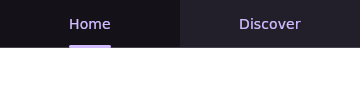

# A tab row, after the tab was clicked

Rendered by `UiBuilderSurface` on the JVM at 360×96dp, density 1, in the Jetcaster benchmark's
environment: a two-tab `m3/primary-tab-row` whose `selectedIndex` is a `state` read of an `int`
variable, each tab `selected` by a `stateEquals` on the same variable, and each tab's `click`
binding a `set` writing its own index. Both frames are the canvas **after** clicking `Discover`.

| before | after |
| --- | --- |
|  |  |

**Before:** the press reaches the reducer and the variable becomes `1`, and nothing moves. The row
read `selectedIndex` with the literal accessor, which sees an object where it wants a number and
falls back to `0`, and each tab read its own `selected` the same way, which sees the `stateEquals`
object and answers `false`. So the indicator stays under `Home` and neither label is emphasised.

**After:** the row and the tabs resolve the variable, so the indicator follows the click and
`Discover` is the selected tab. The export changed with them — `Tab` is emitted with its click
binding rather than `onClick = {}`, and `PrimaryTabRow` with `selectedTabIndex = selectedTab` —
so the generated screen behaves the way this frame does.
