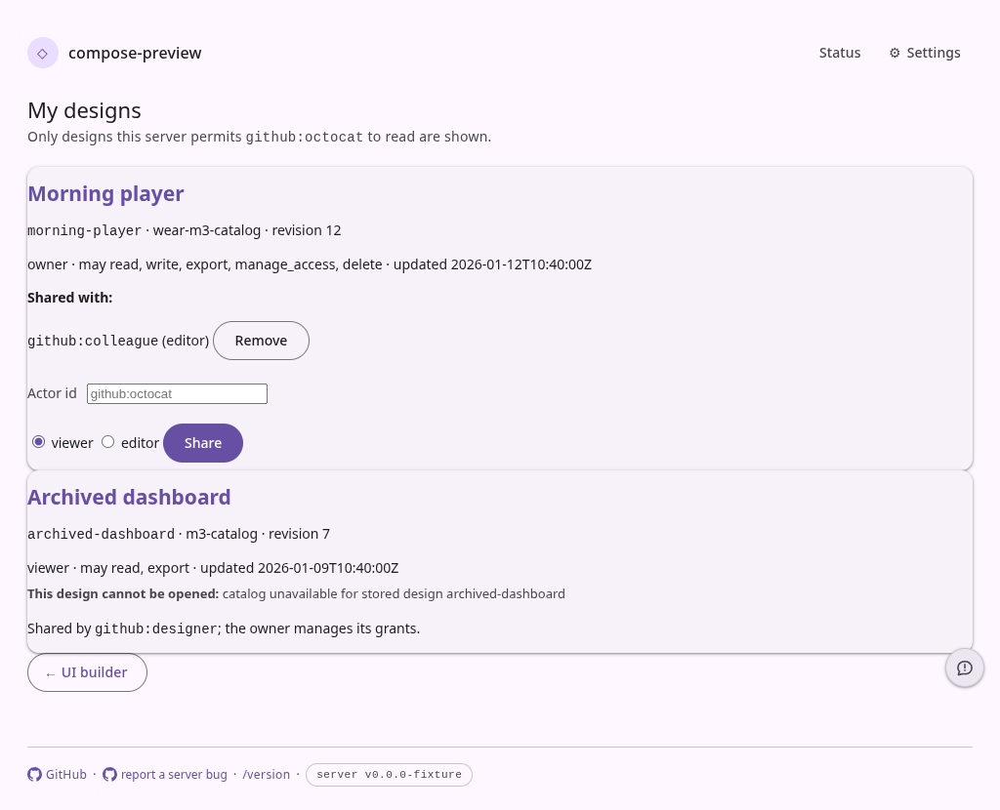
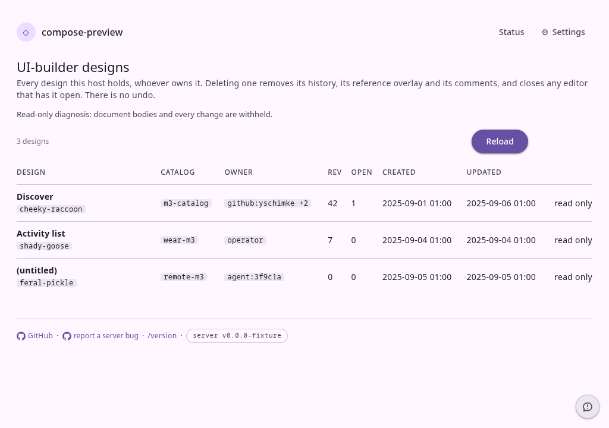

# UI-builder design indexes

There was no actor-facing designs screen before this change: a person had to know a design's URL.
The first capture is the new `/ui-builder/designs` page with an owned design, inline grant controls,
a shared design, and the service's exact reason that the shared design cannot open.

The second capture is `/admin/ui-builder` opened with the diagnostic read credential. It shows the
all-design summary while every row is explicitly read-only; project imports, document download,
repair, and delete are absent.

Both were rendered by `preview-harness/pages-snapshot.spec.mjs` with the production stylesheet.
