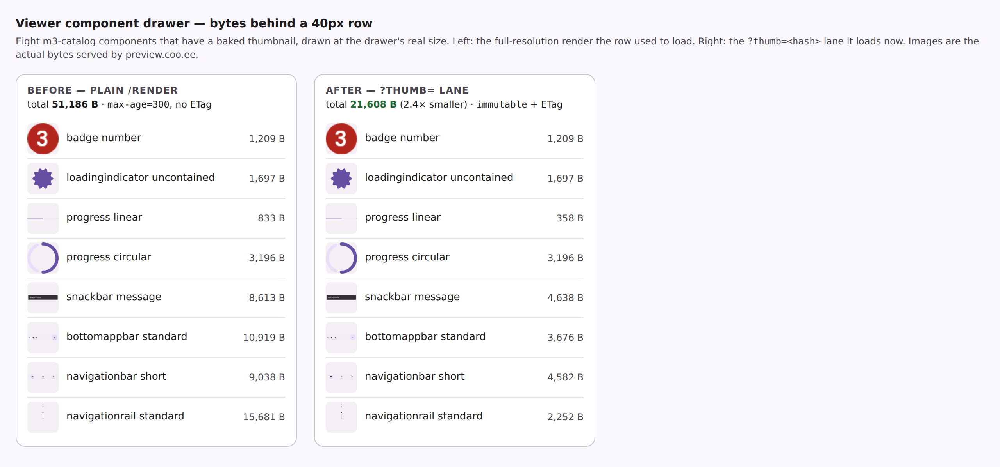

# Viewer component drawer on the prebaked-thumbnail lane

Evidence for the change that points the viewer's component drawer (`navDrawerHtml`) at the
`?thumb=<hash>` lane the catalog grid's cards already use, instead of the plain `/render/<id>.png`.



Eight m3-catalog components that have a baked thumbnail today, drawn at the drawer's real size
(40px). The images are the actual bytes `preview.coo.ee` serves on each lane, so the left column is
what a row used to load and the right column is what it loads now. They are indistinguishable at
display size, which is the point: the row was always a 40px picture and was always fetching a
full-resolution render to draw it.

| | bytes | caching |
| --- | --- | --- |
| plain `/render/<id>.png` | 51,186 | `public, max-age=300, stale-while-revalidate=3600`, **no ETag** |
| `?thumb=<hash>` | 21,608 | `public, max-age=31536000, immutable` + ETag |

Three of the eight are byte-identical, because `bakeGridThumb` keeps whichever encoding is smaller
and a render already under the display cap needs no scaling. Those rows still gain the caching
column, which is the larger practical win: without a validator the five-minute expiry cannot end in
a `304`, so the old lane re-downloaded every row on every revisit.

## What this does *not* claim

Across the whole 57-row drawer on `/m3-catalog/p/<id>` the measured saving today is **60.3 KB of
849.1 KB (7%)**, not the ~58% the issue first estimated. That estimate compared the drawer's 57
previews against the *grid's* 57 thumbnails — a different set of previews — and was wrong.

The reason the figure is small is that only **19 of the drawer's 57 previews have a baked grid
thumbnail at all**; the other 38 fall back to the plain render, on both this surface and the grid
(`/m3-catalog/` serves 38 plain against 20 thumbnailed, `/jetsnack/` 65 against 2). That gap is
tracked separately — it caps both surfaces, and fixing it is what turns this change's 7% into the
full saving, with no further work here.

## Reproducing

```
curl -sS https://preview.coo.ee/m3-catalog/ -o cat.html
curl -sS 'https://preview.coo.ee/m3-catalog/p/button-tonal__ideal__default__light' -o p.html
# drawer rows (plain) vs grid cards (thumbnailed)
grep -oE ']*src="[^"]*/render/[^"?]*\.png"' p.html | wc -l
grep -oE ']*thumb=[0-9a-f]+' cat.html | wc -l
```
