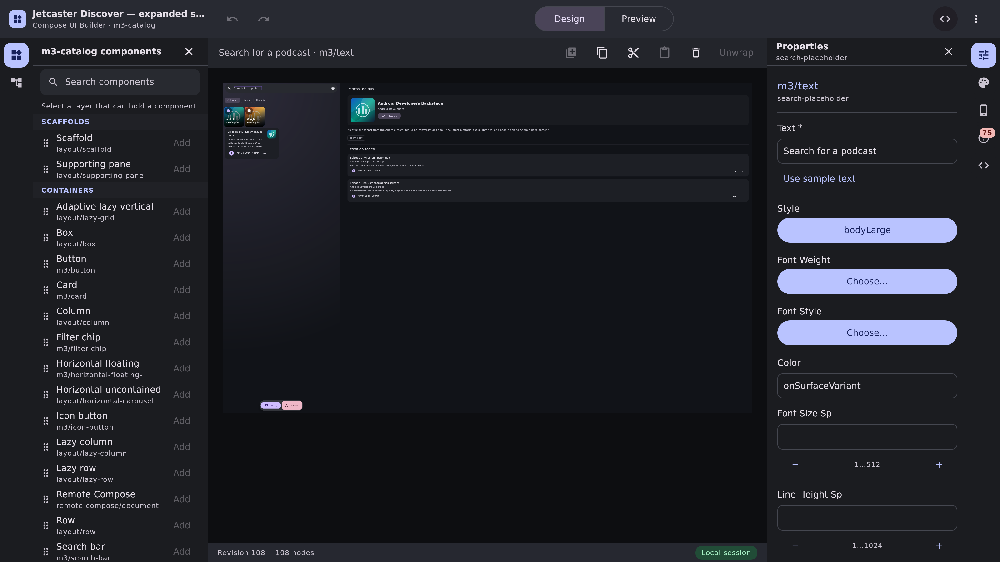

# UI builder — a design you can discuss

Committed evidence for the comment threads, their pins, and the link between comments and markup.

| file | what it is |
| --- | --- |
| `talk-panel.png` | `UiBuilderCommentsPanelPreview` — the Talk dock: anchor chips, a thread answered by an agent, a resolved one behind Show resolved, and pins 1, 3 and 4 on the frame |
| `pins-over-markup.png` | `UiBuilderCommentPinsOverMarkupPreview` — the same discussion with the Screen dock open, so the pins sit beside the strokes they belong to and the Markup section's new **Discuss** button is in the same picture |
| `chrome.before.png` | `UiBuilderEditorChromePreview` at `origin/main` |
| `chrome.after.png` | the same preview on this branch |

## before → after

| before | after |
| --- | --- |
|  |  |

The chrome preview passes no board, so the Talk switch carries no badge in the after shot and nothing
is pinned in either — which is the point of showing it: what moved is the rail. The canvas-forward
chrome made every panel a switch, so a sixth one cost the inspector's width nothing.

Pin 1 in `talk-panel.png` sits at the middle of the red arrow rather than at its tail, because a
thread pinned to a stroke resolves to the centroid of that stroke's extremes — an arrow's tail is
deliberately away from what it is pointing at. Pin 3 is a thread pinned to a bare point on the frame,
and pin 4 is a resolved thread on the green rounded box, drawn grey rather than removed. The thread
anchored to `discover-grid` draws no pin: a node anchor survives the reference being replaced, which
is what it is for, and it has no point of its own to sit on.
